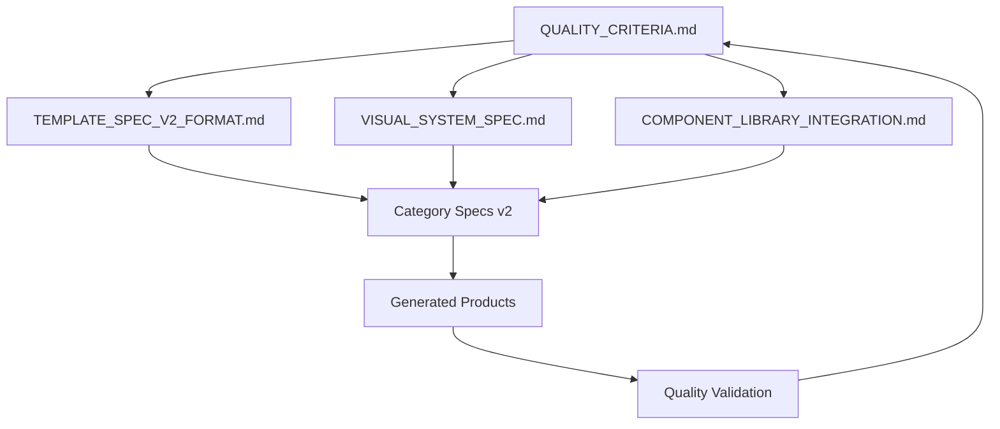

# GUMGENIE SPECIFICATIONS MASTER INDEX
*Complete navigation guide for template specs, quality standards & implementation*

---

## DOCUMENT OVERVIEW

This index provides **complete navigation** across all GumGenie specification documents, **cross-references between systems**, and **how-to-use guidance** for implementing the v2 architecture.

**Purpose**: Ensure consistent, high-quality implementation across all categories and workflows.

---

## 📋 **QUICK REFERENCE INDEX**

### **Core Standards & Guidelines**
- [`QUALITY_CRITERIA.md`](./QUALITY_CRITERIA.md) - **Quality rubric & scoring system** (100-point scale)
- [`TEMPLATE_SPECS_AUDIT.md`](./TEMPLATE_SPECS_AUDIT.md) - **Current state analysis** & identified gaps
- [`TEMPLATE_SPEC_V2_FORMAT.md`](./TEMPLATE_SPEC_V2_FORMAT.md) - **Unified v2 architecture** (market strategy → assets)

### **Implementation Architecture**  
- [`VISUAL_SYSTEM_SPEC.md`](./VISUAL_SYSTEM_SPEC.md) - **Hero presets & 3D modules** (performance + accessibility)
- [`COMPONENT_LIBRARY_INTEGRATION.md`](./COMPONENT_LIBRARY_INTEGRATION.md) - **MCP tool mappings** per category
- [`AGENTS.md`](./AGENTS.md) - **System reliability** & backend architecture

### **Category-Specific Specifications**
- [`templates/AI_PROMPTS_Specs.md`](./templates/AI_PROMPTS_Specs.md) - **AI Prompts v1** (legacy - needs v2 rewrite)
- [`templates/NOTION_Templates_Specs.md`](./templates/NOTION_Templates_Specs.md) - **Notion Templates v1** (legacy)
- [`templates/DIGITAL_PLANNERS_Specs.md`](./templates/DIGITAL_PLANNERS_Specs.md) - **Digital Planners v1** (legacy)
- [`templates/DESIGN_TEMPLATES_Specs.md`](./templates/DESIGN_TEMPLATES_Specs.md) - **Design Templates v1** (legacy)

---

## 🎯 **IMPLEMENTATION WORKFLOW**

### **For New Template Categories**
```markdown
1. Study TEMPLATE_SPEC_V2_FORMAT.md (complete structure)
2. Review QUALITY_CRITERIA.md (80+ point targets)  
3. Check COMPONENT_LIBRARY_INTEGRATION.md (MCP tool mappings)
4. Select appropriate preset from VISUAL_SYSTEM_SPEC.md
5. Create new category spec using v2 format
6. Validate against quality rubric before implementation
```

### **For Existing Category Updates**
```markdown
1. Review TEMPLATE_SPECS_AUDIT.md (identified weaknesses)
2. Compare current spec against TEMPLATE_SPEC_V2_FORMAT.md
3. Update monetization section (3-tier pricing mandatory)
4. Add social proof strategy (testimonials + metrics)
5. Integrate visual system specifications  
6. Test with QUALITY_CRITERIA.md scoring
```

### **For MCP Component Generation**
```markdown
1. Reference COMPONENT_LIBRARY_INTEGRATION.md for category tools
2. Use curated prompts with category-specific context
3. Apply VISUAL_SYSTEM_SPEC.md styling guidelines
4. Validate output against QUALITY_CRITERIA.md standards
5. Ensure 3-tier pricing + social proof inclusion
```

---

## 🔗 **CROSS-REFERENCE MATRIX**

### **Quality Standards Integration**
| Document | Quality Dimension | Score Target | Key Requirements |
|----------|-------------------|--------------|------------------|
| **QUALITY_CRITERIA.md** | All dimensions | 80-100 | Conversion (25) + Visual (25) + Monetization (25) + Completeness (25) |
| **TEMPLATE_SPEC_V2_FORMAT.md** | Monetization + Conversion | 22+ each | 3-tier pricing, social proof, niche positioning |
| **VISUAL_SYSTEM_SPEC.md** | Visual Design | 23+ | WCAG AA, performance budgets, conversion-optimized presets |
| **COMPONENT_LIBRARY_INTEGRATION.md** | Completeness + Conversion | 20+ each | Category-aligned tools, quality validation, fallback strategies |

### **Specification Dependencies**


### **Category-Specific Mappings**
| Category | V1 Spec | V2 Requirements | Visual Preset | MCP Tools | Quality Gap |
|----------|---------|-----------------|---------------|-----------|-------------|
| **AI Prompts** | 83/100 | Market strategy + 3-tier pricing | Neural Network | Magic UI + 21st.dev | -7 monetization |
| **Notion Templates** | 91/100 | Social proof enhancement | Organized Efficiency | shadcn + Magic UI | -5 conversion |
| **Digital Planners** | 77/100 | Complete rewrite needed | Creative Professional | 21st.dev + Magic UI | -10 conversion |
| **Design Templates** | 76/100 | Structure + monetization | Creative Professional | Magic UI + shadcn | -12 multiple |

---

## 📐 **TECHNICAL ARCHITECTURE**

### **System Integration Points**
```typescript
integrationFlow: {
  templateSpecs: "Define content structure + monetization strategy",
  visualSystem: "Apply preset + accessibility + performance constraints", 
  componentLibrary: "Generate category-specific components via MCP",
  qualityValidation: "Score against 100-point rubric",
  generationEngine: "services/geminiService.ts implementation",
  userInterface: "components/ProductPreview.tsx + Sidebar.tsx"
}

dataFlow: {
  userSelection: "TemplateCategory selection",
  specLookup: "Category-specific v2 spec + visual preset + MCP tools",
  contentGeneration: "AI generation with enhanced prompts",
  componentAugmentation: "MCP-generated sections added",
  qualityValidation: "80+ score confirmation",
  userPresentation: "ProductPreview with all elements"
}
```

### **File Structure Standards**
```
specifications/
├── core-standards/
│   ├── QUALITY_CRITERIA.md          # Quality rubric (master reference)
│   ├── TEMPLATE_SPEC_V2_FORMAT.md   # v2 architecture template
│   └── MASTER_SPEC_NAVIGATION.md    # This document
│
├── implementation/
│   ├── VISUAL_SYSTEM_SPEC.md        # Presets + modules + budgets  
│   ├── COMPONENT_LIBRARY_INTEGRATION.md # MCP workflows
│   └── TEMPLATE_SPECS_AUDIT.md      # V1 analysis + gaps
│
├── templates-v1/ (legacy)
│   ├── AI_PROMPTS_Specs.md          # To be replaced
│   ├── NOTION_Templates_Specs.md    # To be replaced
│   ├── DIGITAL_PLANNERS_Specs.md    # To be replaced
│   └── DESIGN_TEMPLATES_Specs.md    # To be replaced
│
└── templates-v2/ (planned)
    ├── AI_PROMPTS_V2.md             # Complete rewrite with v2 format
    ├── NOTION_TEMPLATES_V2.md       # Complete rewrite with v2 format  
    ├── DIGITAL_PLANNERS_V2.md       # Complete rewrite with v2 format
    └── DESIGN_TEMPLATES_V2.md       # Complete rewrite with v2 format
```

---

## 🎨 **STYLE & CONSISTENCY STANDARDS**

### **Documentation Formatting**
```markdown
# Document Standards
- Headings: Use ## for major sections, ### for subsections
- Code blocks: TypeScript for technical specs, Markdown for content examples
- Tables: For comparisons, mappings, and reference data
- Checklists: [ ] for requirements and quality gates
- Emphasis: **bold** for critical terms, *italics* for definitions

# Content Structure  
- Overview section: Purpose, scope, integration points
- Detailed specifications: Technical requirements with examples
- Quality standards: Clear pass/fail criteria
- Implementation guidance: Step-by-step instructions
- Success metrics: Measurable outcomes and targets
```

### **Cross-Reference Standards**
```markdown
# Internal Links
- Relative paths: `./DOCUMENT.md` for same directory
- Absolute paths: `./directory/DOCUMENT.md` for subdirectories  
- Section links: `./DOCUMENT.md#section-heading`

# External References
- GitHub issues: Link to specific implementation tasks
- Code files: Reference exact file paths from repository root
- APIs: Link to documentation or schema definitions

# Version Control
- v1 documents: Mark as "legacy - needs v2 rewrite"  
- v2 documents: Include creation date and last updated
- Deprecated sections: Strike through with replacement guidance
```

---

## 🚀 **IMPLEMENTATION PRIORITIES**

### **Phase 1: Foundation (Current)**
- [x] Quality criteria established (100-point rubric)
- [x] Template specs audited (gaps identified) 
- [x] V2 format defined (comprehensive structure)
- [x] Visual system specified (presets + modules)
- [x] Component integration planned (MCP workflows)
- [x] Master navigation created (this document)

### **Phase 2: Content Production (Next)**
- [ ] AI Prompts v2 spec (complete rewrite using v2 format)
- [ ] Notion Templates v2 spec (enhanced with social proof)
- [ ] Digital Planners v2 spec (major overhaul needed)
- [ ] Design Templates v2 spec (structure + monetization fixes)

### **Phase 3: System Implementation (Following)**
- [ ] Update services/geminiService.ts (v2 prompts + schema)
- [ ] Enhance types.ts (3-tier pricing + social proof)
- [ ] Integrate visual presets (StylePreset system updates)
- [ ] Implement MCP workflows (curated tool sequences)

### **Phase 4: Validation & Optimization (Final)**
- [ ] End-to-end quality testing (80+ score validation)
- [ ] Performance monitoring (budgets + accessibility)
- [ ] User experience testing (conversion optimization)
- [ ] Continuous improvement process (feedback loops)

---

## 📊 **SUCCESS METRICS DASHBOARD**

### **Quality Score Tracking**
```
Current State (V1 Specs):
├─ AI Prompts: 83/100 (good technical, weak monetization)
├─ Notion Templates: 91/100 (excellent, minor conversion gaps)  
├─ Digital Planners: 77/100 (below threshold, needs major work)
└─ Design Templates: 76/100 (below threshold, structural issues)

Target State (V2 Implementation):
├─ AI Prompts: 88/100 (+5 points via monetization fixes)
├─ Notion Templates: 93/100 (+2 points via social proof)
├─ Digital Planners: 86/100 (+9 points via complete rewrite)
└─ Design Templates: 85/100 (+9 points via structure + monetization)
```

### **Business Impact Projections**
```
Conversion Rate Improvements:
- Current: 1.5-3.0% (industry standard for digital products)
- Target: 4.0-7.0% (premium positioning + optimized conversion)
- Improvement: +150-200% conversion rate increase

Average Order Value:
- Current: $15-30 (single pricing tiers)  
- Target: $45-85 (3-tier pricing with most choosing Pro)
- Improvement: +200-280% AOV increase

Customer Satisfaction:
- Current: Unknown baseline
- Target: 4.5+ stars, <5% refund rate
- Metrics: Quality completeness + documentation + support
```

---

## 🔧 **TROUBLESHOOTING & SUPPORT**

### **Common Implementation Issues**
```markdown
Issue: "Quality score below 80 threshold"
Solution: 1) Check monetization section (3-tier pricing mandatory)
          2) Verify social proof elements included
          3) Validate technical specifications completeness
          4) Review against QUALITY_CRITERIA.md checklist

Issue: "MCP component generation failing"  
Solution: 1) Verify server availability in COMPONENT_LIBRARY_INTEGRATION.md
          2) Check prompt context includes category-specific elements
          3) Use fallback tools if primary server unavailable
          4) Generate safe fallback pricing block if all fail

Issue: "Visual preset not applying correctly"
Solution: 1) Confirm preset exists in VISUAL_SYSTEM_SPEC.md
          2) Check category mapping in integration plan
          3) Verify performance budgets not exceeded
          4) Test accessibility compliance (WCAG AA)
```

### **Documentation Updates**
```markdown
When to Update This Document:
- New specification documents added
- Quality criteria or scoring changes
- Implementation workflow modifications  
- Integration points or dependencies change
- Success metrics or targets revised

Update Process:
1. Modify relevant sections in this document
2. Update cross-references and dependencies
3. Test all internal links for accuracy
4. Validate against actual implementation
5. Update last modified date in document header
```

---

## 📞 **CONTACT & GOVERNANCE**

### **Document Ownership**
- **Quality Standards**: Product Team (rubric maintenance)
- **Technical Specs**: Engineering Team (implementation details)
- **Visual System**: Design Team (presets + accessibility)
- **Content Strategy**: Content Team (template specifications)

### **Review & Approval Process**
```markdown
New Specifications:
1. Create draft using TEMPLATE_SPEC_V2_FORMAT.md
2. Validate against QUALITY_CRITERIA.md (80+ target)
3. Technical review (performance + accessibility)
4. Content review (conversion optimization)
5. Final approval (product owner sign-off)
6. Implementation (engineering team)
7. Quality validation (automated + manual testing)
```

### **Version Control & Change Management**
```markdown
Version Numbering: vX.Y.Z
- X: Major architectural changes (full system redesign)
- Y: Minor feature additions (new categories, enhanced specs)  
- Z: Bug fixes and clarifications (documentation updates)

Change Log: Track all modifications with:
- Date modified
- Section(s) changed  
- Reason for change
- Impact on other documents
- Required follow-up actions
```

**This master navigation ensures consistent, high-quality implementation across all GumGenie specifications and provides clear guidance for teams working with the v2 architecture.**